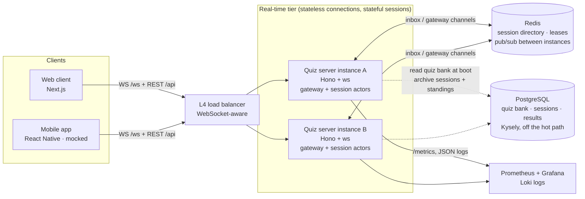
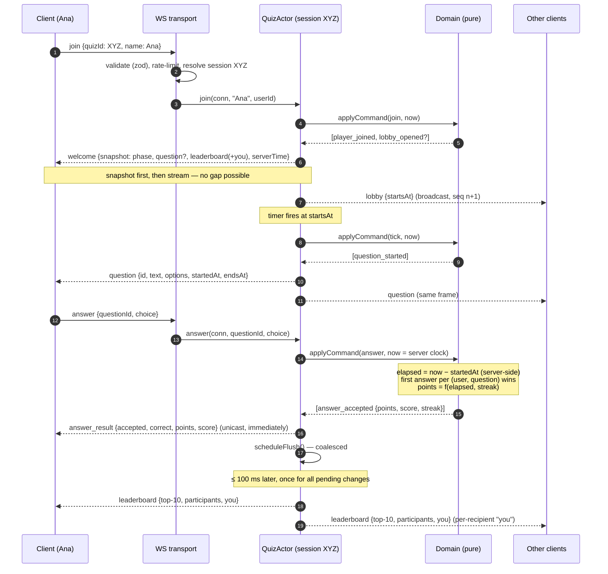
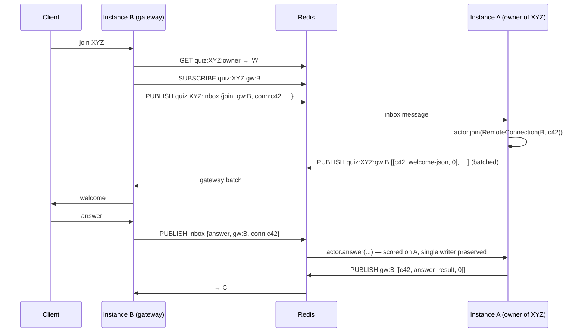

# Real-Time Vocabulary Quiz — System Design

> Part 1 of the ELSA coding challenge. The component implemented in this repository is the
> **real-time quiz server** (`apps/server`) plus a demo web client (`apps/web`) and a shared
> wire protocol (`packages/protocol`). Persistence (quiz bank, session archive) is implemented
> on Postgres behind an optional `DATABASE_URL`; auth, content authoring and analytics are
> mocked or described only.

- [1. Goals and non-goals](#1-goals-and-non-goals)
- [2. Architecture](#2-architecture)
- [3. Components](#3-components)
- [4. Data flow](#4-data-flow)
- [5. Wire protocol](#5-wire-protocol)
- [6. Scoring and leaderboard rules](#6-scoring-and-leaderboard-rules)
- [7. Technology choices](#7-technology-choices)
- [8. Building for the future](#8-building-for-the-future)
  - [8.1 Scalability](#81-scalability) · [8.2 Performance](#82-performance) · [8.3 Reliability](#83-reliability) · [8.4 Maintainability](#84-maintainability) · [8.5 Monitoring and observability](#85-monitoring-and-observability)
- [9. Trade-offs and alternatives considered](#9-trade-offs-and-alternatives-considered)
- [10. AI collaboration in design](#10-ai-collaboration-in-design)

---

## 1. Goals and non-goals

**Goals (from the brief)**

1. Users join a quiz session with a unique quiz id; many users can join the same session at once.
2. Scores update in real time as answers are submitted; scoring is accurate and consistent.
3. A leaderboard shows current standings and updates promptly as scores change.

**Derived requirements** that shaped the design:

- *Consistency beats cleverness.* A score must never be double-counted, lost, or depend on the
  order in which two server threads happened to run. → single writer per session (§2).
- *Fan-out is the real cost, not scoring.* One answer is cheap; telling 5 000 people about it is
  not. → coalesced leaderboard broadcasts (§8.2).
- *Clients lie, disconnect and retry.* Timing must be server-authoritative and every message
  idempotent. → server-measured elapsed time, first-answer-wins (§6), snapshot-then-stream (§4).

**Non-goals for this submission**: authentication (a display name is enough), a question
authoring UI, persisting results beyond the session, mobile apps.

## 2. Architecture



The one idea everything else follows from: **one quiz session = one actor**, living on exactly
one server instance at a time. All commands for a session (join, answer, timer ticks) are
applied strictly in order by that actor, so there is no lock, no transaction and no race to
reason about — the "scores must be accurate and consistent" requirement is a structural property
rather than something each code path has to remember.

Instances are otherwise symmetric: every instance can accept any client's WebSocket. If the
session the client asks for is owned by another instance, the receiving instance acts as a
**gateway** and forwards through Redis (see §8.1). A single instance with no Redis is a perfectly
valid deployment for small scale — that is the default `pnpm dev` mode.

## 3. Components

| Component | Location | Role |
|---|---|---|
| **Shared protocol** | `packages/protocol` | Zod schemas + TypeScript types for every WebSocket and REST message. Imported by server *and* client, so a shape change is a compile error on both sides. Also validates every inbound frame at runtime. |
| **Domain** | `apps/server/src/domain` | Pure, deterministic rules: `scoring.ts` (points from elapsed time + streak), `leaderboard.ts` (total-order ranking), `session.ts` (the lobby → question → reveal → finished state machine). No I/O, no clock — every command carries `now`. 100 % unit- and property-tested. |
| **Quiz actor** | `apps/server/src/actor/quiz-actor.ts` | Owns one session's state. Feeds commands to the domain, turns domain events into wire messages, schedules phase timers from `nextDeadline()`, and **coalesces leaderboard fan-out** (≤ 1 broadcast per 100 ms per session). Talks to clients only through the `Connection` interface. |
| **Session registry** | `apps/server/src/actor/registry.ts` | Creates/finds/disposes actors on this instance; idle sessions are disposed after a TTL; generates human-friendly 6-character session codes. |
| **Cluster layer** | `apps/server/src/cluster` | Optional (enabled by `REDIS_URL`). `SessionDirectory` = ownership leases + session metadata in Redis; `RedisBus` = pub/sub; `RemoteSession` (gateway side) forwards join/answer/detach to the owner; `RemoteGateway` (owner side) batches deliveries back, one publish per gateway per event-loop turn. |
| **WebSocket transport** | `apps/server/src/transport/ws.ts` | Per-socket handler: parse + validate frame → token-bucket rate limit → route to the session. Exposes the socket as a `Connection` with backpressure awareness; heartbeat ping/pong reaps dead sockets. |
| **HTTP transport** | `apps/server/src/transport/http.ts` | Session lifecycle (`POST /api/sessions`, `/start`, `/restart`), quiz catalogue, a polling fallback for the leaderboard, and `/healthz` `/readyz` `/metrics`. |
| **Observability** | `apps/server/src/observability` | `pino` structured logs (quizId/userId on every line) and Prometheus metrics via `prom-client`. |
| **Quiz bank** | `apps/server/data/quizzes.json` → Postgres | Validated at boot (duplicate ids, out-of-range answers fail fast). With `DATABASE_URL` it is seeded into and read from the `quizzes`/`questions` tables. |
| **Persistence** | `apps/server/src/db` | Kysely + `pg`. `0001_initial` migration (quizzes, questions, sessions, session_results), typed schema, `QuizStore` and `SessionArchive` repositories. Writes happen on session creation and completion only — fire-and-forget with logging, never on the answer path. `GET /api/history`, `GET /api/sessions/:id/results`. |
| **Web client** | `apps/web` | Next.js App Router. `useQuizSocket` hook = client half of the protocol (validate, reduce, reconnect with backoff, re-join with stored userId). Two pages: join (`/`) and room (`/quiz/[id]`). |
| **Load generator** | `apps/server/scripts/loadtest.ts` | Worker-thread bot swarm measuring join→welcome, answer→ack and answer→leaderboard-visible latency, plus a diff of server metrics. |

## 4. Data flow

### 4.1 Join → answer → leaderboard



### 4.2 Session lifecycle

```
lobby ──(first join + lobbyMs, or POST /start)──▶ question ──(endsAt + grace, or all answered)──▶ reveal ──(revealMs)──▶ question … ──▶ finished ──(idle TTL)──▶ disposed
```

The lobby countdown starts with the *first* join, not at creation, so a session created by a
host in advance does not burn through its questions with nobody in it. Late joiners are welcome
in any phase and receive the current question with its remaining time in the snapshot.

### 4.3 Reconnect

A client that loses its socket reconnects with exponential backoff and re-sends `join` with the
`userId` it was issued (kept in `localStorage`) and the last `seq` it saw. The server treats it
as the same player (score and answers intact), answers with a fresh snapshot and logs how far
behind the client was. Because the snapshot is complete, no replay log is needed for
correctness; `seq` exists so the client can detect a gap and re-sync.

### 4.4 Cross-instance flow (cluster mode)



## 5. Wire protocol

Defined once in `packages/protocol/src/index.ts`. Highlights:

| Direction | Message | Notes |
|---|---|---|
| C→S | `join {quizId, name, userId?, lastSeq?}` | `quizId` is `[A-Za-z0-9_-]{1,32}`; `name` ≤ 24 chars. |
| C→S | `answer {questionId, choice}` | `choice` is an index into the options; no timestamp — timing is server-side. |
| C→S | `ping` | Application-level liveness (in addition to WS ping/pong). |
| S→C | `welcome` | Full snapshot: `you`, `quiz`, `phase`, `question?`, `correctChoice?` (reveal only), `startsAt?`, `leaderboard` with `you`, `serverTime`. |
| S→C | `question` | Public question (never includes the answer), `startedAt`/`endsAt`, `serverTime` for clock offset. |
| S→C | `answer_result` | Unicast, immediate. `accepted` + `reason` (`already_answered` / `too_late` / `not_open` / `unknown_question`), `points`, running `score`, `streak`. |
| S→C | `leaderboard` | Coalesced broadcast: `top` (N=10), `participants`, per-recipient `you`. |
| S→C | `question_end` | `correctChoice`, `answered`, `correctCount`, `nextAt`. |
| S→C | `quiz_end` | Final leaderboard with `you`. |
| S→C | `lobby` | Countdown start. There is deliberately **no per-player "X joined" broadcast** (O(N²) during a join storm — see §8.2). |
| S→C | `error {code}` | `bad_message`, `not_joined`, `quiz_not_found`, `rate_limited`, `internal`. The socket stays open. |

Broadcast messages carry a per-session monotonically increasing `seq`; unicasts carry the
latest broadcast `seq`. The client ignores a broadcast whose `seq` is lower than one already
applied.

## 6. Scoring and leaderboard rules

**Points** (`domain/scoring.ts`), Kahoot-style so speed matters but a slow correct answer still
beats a wrong one:

```
timeFactor       = minFraction + (1 − minFraction) × (1 − clamp(elapsed / timeLimit, 0, 1))   // 1.0 → 0.5
streakMultiplier = 1 + min(streakBefore, 5) × 0.10                                              // up to ×1.5
points           = round(basePoints(1000) × timeFactor × streakMultiplier)   if correct, else 0
```

- `elapsed` is measured by the server: answer receive time − question open time. Network
  latency counts against the player (a few ms); that is preferable to trusting a client clock.
- Answers within `graceMs` (500 ms) after `endsAt` are accepted at the floor, so a tap at 0.0 s
  on a slow connection is not lost; later ones are rejected as `too_late`.
- **First answer per (user, question) is the only one that counts.** A retry after a flaky
  network or a double-tap is acknowledged as `already_answered` and changes nothing. This is
  what makes the protocol safe to retry blindly.
- Not answering resets the streak, like a wrong answer.

**Leaderboard** (`domain/leaderboard.ts`) is a strict total order:
`score DESC → scoreSeq ASC → userId ASC`, where `scoreSeq` is a monotonic counter captured when
the player last changed score. Among equal scores, whoever reached the score first ranks higher,
and the third key guarantees two renders of the same state never disagree — a board that
flickers between tied players is a real UX bug that a naive `sort by score` produces. Ranks are
dense (1, 2, 3, …). Invariants (sortedness, contiguity, permutation, determinism, total order)
are property-tested with `fast-check`.

## 7. Technology choices

| Layer | Choice | Why | Considered instead |
|---|---|---|---|
| Runtime | **Node.js 22+ / TypeScript (strict)** | Event loop suits tens of thousands of mostly-idle sockets; single-threaded execution is exactly the actor guarantee we want; one language end-to-end with shared types. | Go (better raw throughput, no shared types with the client); Elixir/Phoenix Channels (the gold standard for this shape, but a second language/runtime for the team). |
| HTTP framework | **Hono** | Tiny, fast, Web-standard `Request`/`Response`. The same router runs unchanged on Cloudflare Workers, where **Durable Objects are the managed version of "one session = one actor"** — a credible production path without a rewrite. | Fastify (richer plugin ecosystem, Node-only). |
| WebSocket | **`ws`** via `@hono/node-ws` | The fastest mainstream WS library for Node, no protocol overhead. We design the protocol ourselves, which is what is being evaluated. | Socket.IO (rooms/reconnect for free, but extra framing, and it hides exactly the mechanics under review); uWebSockets.js (~2–4× faster fan-out, native binary, harder to install and review). |
| Validation | **zod** | One schema = runtime validation + static types, shared by server and client. | JSON Schema + ajv (faster, but two artefacts to keep in sync). |
| Cross-instance | **Redis** (pub/sub + `SET NX PX` leases) | One dependency covers the directory, ownership leases and message bus. Already the industry default for this. | NATS (nicer pub/sub semantics, another service); Kafka (durable, but overkill and higher latency). |
| Durable store | **PostgreSQL + Kysely** | Quiz content and final results are relational and low-volume; never on the hot path. Kysely gives typed queries and file-based migrations without an ORM's runtime magic. | Prisma/Drizzle (heavier tooling or codegen); raw `pg` (no types). |
| Client | **Next.js + Tailwind + Radix Primitives** | Fast to build a polished demo; shares `@quiz/protocol` so the UI cannot drift from the server. Radix gives accessible, unstyled dialogs/selects/progress/tooltips that we style ourselves. WebSocket handled by a plain `WebSocket` in one hook — no client library needed. | Plain HTML (zero build, but no shared types); a full component kit (more to fight against). |
| Tests | **vitest + fast-check** | Fast, TypeScript-native; property tests catch the invariants examples miss. | Jest. |
| Logs / metrics | **pino + prom-client** | Structured JSON logs and Prometheus metrics are what every platform ingests. | OpenTelemetry (discussed in §8.5; adds tracing when there are multiple services). |
| Tooling | **pnpm workspaces, tsx, Biome** | One lockfile; instant dev reloads; one tool for lint + format. | — |

## 8. Building for the future

### 8.1 Scalability

**Where the load actually is.** Consider one session with N players and Q questions. Answers
are O(N·Q) — trivially cheap (the domain processes an answer in well under a millisecond).
Broadcasts are O(N × number-of-broadcasts): the naive design that pushes a fresh leaderboard on
every answer is O(N²) per question. That term is the whole problem.

**Three levers, in the order we pull them:**

1. **Coalescing (implemented).** The actor marks the board dirty and flushes at most once per
   `LEADERBOARD_INTERVAL_MS` (100 ms). 5 000 answers in a second → ≤ 10 fan-outs instead of
   5 000; the leaderboard is still visibly live (p99 answer→board-visible ≈ 140 ms at 5 000
   players, see §8.2). Trade-off: the *first* change in a burst is sent at once (leading edge),
   the rest wait up to one interval.
2. **Many sessions → many instances (implemented, `REDIS_URL`).** Sessions are independent, so
   they shard perfectly by `quizId`. Ownership is a Redis lease; a client can connect to any
   instance and is proxied to the owner. Add instances → add capacity for sessions *and* for
   connections.
3. **One huge session → gateways (implemented, same mechanism).** A single very popular session
   is still one actor, but its *fan-out* is spread: the owner publishes one batch per gateway per
   flush (≈ 1.2 ms measured with 1 000 remote players, vs 41 ms doing 5 000 socket writes
   itself), and each gateway writes to its own sockets on its own event loop. Scoring stays
   single-writer; only connection handling scales out.

**Limits and the next steps** (not implemented, described so the path is clear):

- *Hot-session ceiling on one gateway.* Fan-out to 5 000 local sockets costs ~41 ms of event
  loop per flush; at ~15 000 sockets per process the 100 ms interval would be saturated. Beyond
  that: more gateways (above), pre-framed broadcast (uWebSockets.js `publish`), or delta
  leaderboards (send `you` only when the recipient's rank changed).
- *Leaderboard ranking* is an O(N log N) sort per flush, cached until dirty. At 100 k players it
  would be ~10 ms; a sorted set (skip list, or a Redis ZSET as the read model) makes rank
  lookups O(log N) and top-N O(N) — the swap is local to `domain/leaderboard.ts`.
- *Redis pub/sub* is at-most-once and single-node. For durability of session state see §8.3;
  for throughput, Redis Cluster shards channels by key (`quiz:{id}:*` all hash to one slot).
- *Managed alternative.* Deploy the actor as a Cloudflare Durable Object (Hono runs there
  natively): the platform provides the single-writer guarantee, location, hibernating WebSockets
  and storage, and the gateway layer disappears.

### 8.2 Performance

Measured with `pnpm test:load` on this development machine (single Node process, `ws`, 10
questions, random answers 0.2–2.5 s after each question; raw JSON in `docs/loadtest/`):

| Players in one session | 500 | 2 000 | 5 000 | 1 000 via a gateway (Redis) |
|---|---|---|---|---|
| connected / finished | 500 / 500 | 2 000 / 2 000 | 5 000 / 5 000 | 1 000 / 1 000 |
| answers processed | 5 000 | 20 000 | 50 000 | 10 000 |
| answer → `answer_result` p50 / p99 | 0.6 / 9.8 ms | 0.4 / 22.9 ms | 0.5 / 47.4 ms | 1.3 / 29.1 ms |
| answer → visible on leaderboard p50 / p99 | 55 / 107 ms | 61 / 117 ms | 76 / 137 ms | 72 / 125 ms |
| leaderboard fan-outs (vs. answers) | 248 (vs 5 000) | 270 (vs 20 000) | 305 (vs 50 000) | 263 (vs 10 000) |
| cost of one fan-out on the owner | 8.7 ms | 20.6 ms | 41.4 ms | **1.2 ms** |
| messages sent | 138 k | 581 k | 1.55 M | 284 k |
| dropped for backpressure | 0 | 0 | 0 | 0 |
| server CPU (one core) | 10 % | 22 % | 42 % | 11 % (owner) |

What the numbers say: scoring itself is ≤ 0.5 ms at p99 regardless of size; the tail of the ack
latency grows linearly with players because the event loop is busy fanning out (single-threaded
by design), and the leaderboard latency is bounded by the coalescing interval plus one fan-out.
The gateway column shows the split working: with sockets on another instance the owner's
fan-out cost drops 35×.

**Optimisations that are in the code:**

- Coalesced, dirty-flag driven flushes; an answer that changes nothing on the board (wrong, no
  streak) does not schedule one.
- No per-join broadcast — the join storm for 2 000 players went from 2.6 M to 0.6 M messages
  (−77 %) and server CPU halved when this was removed.
- The common part of a leaderboard message is serialised **once**; the per-recipient `you` is
  spliced in as a string (verified against the schema by a property test).
- Ranking is cached until the state changes.
- Rate limiting (token bucket) and validation happen before any allocation of session work.
- Backpressure: droppable messages (leaderboard snapshots) are skipped for a socket whose send
  buffer exceeds 1 MB; questions and results are never dropped.
- Batching across instances: one Redis publish per gateway per event-loop turn, not per socket.

### 8.3 Reliability

| Failure | Behaviour |
|---|---|
| Malformed / hostile frame | Rejected by zod, `error` sent, socket stays open, counted in `quiz_client_errors_total`. A thrown handler error is caught per frame — it can never take down the process or the session. |
| Client floods | Token bucket (20 msg/s, burst 40) → `rate_limited`. |
| Client disconnects / flaky mobile | WS heartbeat reaps dead sockets in ≤ 2 × 30 s; player state survives; reconnect with `userId` restores the score; snapshot-then-stream guarantees no gap. |
| Double submit / retry | Idempotent: first answer wins, retries acknowledged with `already_answered`. |
| Slow consumer | Backpressure drops only idempotent snapshots; the next flush supersedes them. |
| Instance shutdown (`SIGTERM`) | Leases released *first*, sockets closed with `1001`; clients reconnect and are re-homed on another instance (from Redis metadata) — the quiz restarts from the lobby (see limitation below). |
| Instance crash | Lease expires (`SESSION_LEASE_MS`, 15 s). Meanwhile a gateway whose join gets no reply within 3 s declares the owner dead and bounces its clients with `1012` so they reconnect to a re-homed session. Tested in `test/integration/cluster.test.ts`. |
| Redis outage | Single-instance mode is unaffected (Redis is optional). In cluster mode the owner keeps serving local sockets; lease renewals fail and after the lease lapses the actor disposes itself to avoid a split brain. `/readyz` goes 503 so the load balancer stops routing new connections. |
| Bad quiz content | The bank is validated at boot (duplicate ids, `correctChoice` out of range) — fail fast, not at question 7. |

**Known limitation, and the fix:** session *state* lives in the owner's memory. Re-homing after
a crash restarts the session from the lobby. The extension is straightforward because the
domain is already event-sourced in shape (`applyCommand` returns events): append each
command to a Redis Stream (`quiz:{id}:log`) and have the new owner replay it before accepting
traffic; snapshot at phase transitions to bound replay time. This was left out to keep the
submission focused on the real-time path.

### 8.4 Maintainability

- **Layers with one direction of dependency:** `protocol` ← `domain` ← `actor` ← `transport` /
  `cluster`. The domain has no imports from the outer layers and no I/O, so rules can be read
  and tested in isolation; the actor knows nothing about sockets or Redis (`Connection`,
  `SessionHandle`); the transport knows nothing about scoring.
- **One protocol definition** consumed by both sides; changing a message shape breaks the build
  where it should.
- **Tests at every layer** (`pnpm test`, 52 tests): domain unit + property tests, actor tests with
  fake connections and fake timers, integration tests over real WebSockets on an ephemeral port,
  cluster tests with a real Redis (skipped without `REDIS_URL`). CI runs lint, typecheck and all
  of them (`.github/workflows/ci.yml`).
- **Configuration** is a single validated `Config` object with documented defaults
  (`src/config.ts`); no magic numbers in the code paths.
- **Strict TypeScript** (`noUncheckedIndexedAccess`, `exactOptionalPropertyTypes`) and Biome for
  lint + format, so reviews are about design, not style.
- Names describe intent (`scheduleFlush`, `broadcastWithYou`, `everyoneAnswered`), comments
  explain *why* (the join-storm comment, the stale-cache comment), and every non-obvious
  optimisation has a test that would fail if it broke (`spliceYou`).

### 8.5 Monitoring and observability

**Metrics (Prometheus, `/metrics`)** — named after what someone on call would page on:

| Metric | Why it matters |
|---|---|
| `quiz_answer_processing_seconds` (histogram) | The core SLI: receive → result. Alert if p99 > 50 ms. |
| `quiz_leaderboard_flush_seconds` (histogram) | Fan-out cost per session flush; growth = a hot session approaching the ceiling (§8.1). |
| `quiz_messages_dropped_total{reason}` | `backpressure` = slow clients or an overloaded instance; `socket_closed` = churn. |
| `quiz_answers_total{result}` | Accepted vs each rejection reason; a spike in `too_late` means clock/latency trouble, in `already_answered` a retrying client. |
| `quiz_ws_connections`, `quiz_sessions_active`, `quiz_participants` | Capacity planning and autoscaling signals. |
| `quiz_client_errors_total{code}` | `bad_message`/`rate_limited` spikes = abuse or a broken client release. |
| `nodejs_eventloop_lag_seconds` (default) | The single best "this instance is saturated" signal for a Node service. |

The load generator diffs these before/after a run, which is how the numbers in §8.2 were produced.

**Logs** are structured JSON (pino) with `instance`, `quizId`, `userId`, `connId` on every
relevant line, so one `quizId` filter in Loki/Datadog reconstructs a session's story.
Reconnects log how far behind the client was (`behind: seq − lastSeq`).

**Health:** `/healthz` (process up) and `/readyz` (Redis reachable when configured) for load
balancers and Kubernetes probes.

**What I would add in production:**
- **End-to-end synthetic probe**: a bot (the load generator with `--clients 1`) that joins a
  canary session every minute and reports answer→leaderboard latency from outside — the metric
  users actually feel, measured from the internet.
- **Tracing** (OpenTelemetry): a span from `join` on the gateway through Redis to the owner's
  actor, once there are multiple hops.
- **Dashboards**: per-session participants/fan-out cost; per-instance connections/event-loop
  lag; a "top sessions by flush cost" table to spot the hot one early.
- **Alerts**: p99 answer latency, dropped-message rate, event-loop lag, and `readyz` failures.

## 9. Trade-offs and alternatives considered

| Decision | Alternative | Why this way |
|---|---|---|
| Actor per session (single writer) | Stateless servers + Redis ZSET (`ZINCRBY`) for scores | ZSET is atomic per command but the *rules* (first answer wins, streaks, grace window, phase) still need coordination — a Lua script or locks. The actor keeps all rules in one testable place; Redis stays a bus, not a database of half the logic. |
| Coalesced leaderboard (≤ 10 Hz) | Push on every change | O(N²) messages; nobody can perceive 100 ms on a leaderboard. |
| Snapshot on every join, `seq` for gap detection | Replay log per session | Snapshot is complete and simpler; a replay log only matters if snapshots were expensive. |
| Server-measured elapsed time | Client timestamp (or RTT compensation) | Clients cannot be trusted; RTT compensation is gameable. The cost is a few ms of fairness. |
| WebSocket | SSE + HTTP POST | SSE (server→client) plus POST (client→server) would work and is simpler to load-balance, but two channels double the reconnection logic; WS is the right tool for bidirectional low-latency traffic. |
| `ws` | Socket.IO / uWebSockets.js | See §7. |
| No "X joined" broadcast | Broadcast joins | O(N²) during join storms; the participant count rides the coalesced leaderboard instead. |
| Redis pub/sub for the cluster | NATS, Kafka, gRPC between instances | One dependency, good enough at this scale; the `Bus` interface is the seam to swap it. |
| Rank via sort per flush | Persistent sorted structure | Simpler; cached; fine to ~10⁴ players per session — swap is local when needed. |
| Session state in memory | Event log in Redis Streams | Left as the documented next step (§8.3); the domain shape already supports it. |

## 10. AI collaboration in design

Claude Code (Opus) was the design partner from the first brainstorm; the full log with prompts
and verification is in [`AI_COLLABORATION.md`](./AI_COLLABORATION.md). In the design phase
specifically:

- **Brainstorm (entry #1):** I asked for ideas before any code. The AI proposed the
  actor-per-session model, coalesced fan-out, snapshot-then-stream, server-side timing and
  a total-order tie-break, and — importantly — named the hot-session weakness of its own
  proposal, which became §8.1. I chose it over the Redis-ZSET-centric alternative it also laid
  out, for the reasons in §9.
- **Stack (entry #2):** I asked "which stack?", then pushed back with "what about Hono +
  Next.js?". The AI agreed on Hono (and surfaced the Durable Objects angle) but warned that
  Next.js cannot host the WebSocket upgrade — so the server is a separate process. That is the
  monorepo shape you see.
- **Verification of design claims:** every performance claim in this document comes from the
  load generator, not from the AI's estimates. Its initial estimate ("one Node process handles
  ~100 k msg/s") was directionally right but the *join storm* (O(N²) `player_joined`
  broadcasts) was a scalability bug in the AI's first design that only the 2 000-player run
  exposed; removing it cut messages by 77 %. Section 8.2 was rewritten from measurements.
- **Diagrams:** Mermaid drafts were AI-generated from the code, then checked against the actual
  call paths (e.g. the gateway sequence was corrected to show batching happens on the owner).
